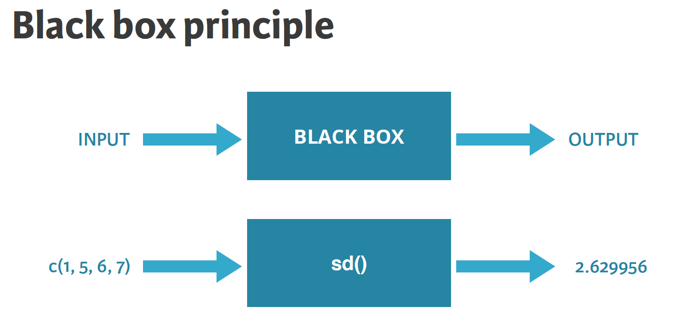

```{r setup, include=FALSE}
knitr::opts_chunk$set(echo = TRUE)
```

{width="400" height="50"}

## **Instructors**

Yuan Chai (chaix026\@umn.edu)\
Ali Joglekar (joglekar\@umn.edu)\

## Introduction to R Basics

### Use R as a calculator

Calculate 8/5

```{r}
8/5
```

### R Objects

In R, an analysis is normally broken down into a series of steps. Intermediate results are stored in **objects**. In fact, the fundamental design principle underlying R is "**everything is an object**".

### Create and Remove an R object

To create an R object, we need to assign a name (and usually a value) to an object.

-   Object names must start with a letter and can only contain letters, numbers, periods, and underscores.

-   Examples of allowable R object names:

    -   `x`, `A`, `my_Variable`, `variable3`, `my.other.variable`

-   Try to name your objects with something meaningful to you so you remember what they are

    -   Example: `test_score`, `reaction_time`, etc.

-   Object names are case-sensitive, so you could have variables called `a` and `A`, and they would be distinct.

-   Values are assigned to an object using the `<-` symbol (or `=` symbol)

```{r}
# Variables
# A variable is the name you assign to stand for some number or set of numbers. 
x <- 8

# You can also make a variable equal the result of a computation:
x <- 8*5

# You can find the current value of a variable by entering its name:
x
```

You can use variables in calculations just like they were numbers:

```{r}
y <- x*7
y
```

To remove a variable (or any other R object), use the `rm()` function

```{r}
# remove y variable
rm(y)
```

### Basic variable types

Basic variable types include:

-   numeric

-   character

-   logical

```{r}
# Declare variables of different types
my_numeric <- 42
my_character <- "universe"
my_logical <- FALSE 

# Display variables
my_numeric
my_character
my_logical
```

### Functions

Functions are computations that already exist in R. They perform computations of the values you provide. For example: `sum()`, `prod()`, `log()`, ect.

-   Functions work like a black box;

-   Argument matched by position or by name;

-   Function arguments can have defaults.

{width="535"}

```{r}
sum(3,4,5,6)
prod(3,4,5,6)
```

### Vectors

-   Vectors represent sets of measurements (e.g. a score for each person).

-   Vectors are created in R using the special `c()` function, which means concatenate.

-   `c()` takes a set of numbers or vectors and concatenates them into one vector.

**Create vectors**

```{r}
# create vectors
vec1 <- c(9,8,7,6)
vec2 <- c(1,2,3,4)

# display vectors
vec1
vec2
```

Patterned vectors

```{r}
vec_interval <- 1981:2005
vec_interval
```

```{r}
vec_seq <- seq(from=2, to=20, by=2)
vec_seq
```

### Matrix

Create a matrix

```{r}
# Create a 2x3 matrix containing the elements 1:6, by column
A <- matrix(1:6, nrow=2)
A
```

Get dimensions of a matrix

```{r}
# Dimension 
dim(A)
nrow(A)
ncol(A)
```

Sub-setting elements of a matrix

```{r}
a_1_2 <- A[1, 2]
a_1_2
```

### Dataframes

-   If you have a set of measurements on the same set of subjects, it's useful to organize them into a single structure called a dataframe.

-   A dataframe is like a matrix, meaning it has rows and columns. Each column is a variable and each row is a subject.

#### Create a dataframe

```{r}
# Definition of vectors
name <- c("Mercury", "Venus", "Earth", "Mars", "Jupiter", "Saturn", "Uranus", "Neptune")
type <- c("Terrestrial planet", "Terrestrial planet", "Terrestrial planet", 
          "Terrestrial planet", "Gas giant", "Gas giant", "Gas giant", "Gas giant")
diameter <- c(0.382, 0.949, 1, 0.532, 11.209, 9.449, 4.007, 3.883)
rotation <- c(58.64, -243.02, 1, 1.03, 0.41, 0.43, -0.72, 0.67)
rings <- c(FALSE, FALSE, FALSE, FALSE, TRUE, TRUE, TRUE, TRUE)

# Create a data frame from the vectors
df_planets <- data.frame(name, type, diameter, rotation, rings)
df_planets
```

#### Dataframe structure and subsetting

Use function `str()` to explore the structure of a dataframe, such as number of obs, number of variables, variable names, type, and variable values.

```{r}
str(df_planets)
```

Use the `df[rows, cols]` to subset rows and cols of a dataframe

```{r}
# diameter of Mercury (row 1, column 3)
df_planets[1, 3]
```

```{r}
# Mars
df_planets[4, ]
```

```{r}
# First 5 values of diameter column
df_planets[1:5, 'diameter']
```

Use the `$` operator to select a variable from a dataframe

```{r}
# Select the variable "rings" from df_planets
rings_vector <- df_planets$rings
rings_vector
```

Use a logical vector to select rows from a dataframe

```{r}
# Select planets with rings
df_planets[rings_vector, ]
```

```{r}
# Select planets with diameter < 1
sel_diameter <- (df_planets$diameter < 1)
sel_diameter 
df_planets[sel_diameter, ]
```

Order dataframe

```{r}
# Use order() to create positions
positions <-  order(df_planets$diameter)

# Use positions to sort planets_df
df_planets[positions,]
```

------------------------------------------------------------------------

#### Exercise

Create a vector named `months` with values of `("Jan", "Feb", "Mar")`

Create a vector named `temp` with values of `(15, 18, 20)`

Create a vector named `rain` with values of `(10, 20, 30)`

Create a dataframe named `df_weather` with three variables `months, temp, rain` as above

Subset for the rainfall of February and March

```{r}


```

Answer:

``` r
# Create a vector named months with values of ("Jan", "Feb", "Mar")
months <- c("Jan", "Feb", "Mar")

# Create a vector named temp with values of (15, 18, 20)
temp <- c(15, 18, 20)

# Create a vector named rain with values of (10, 20, 30)  
rain <- c(10, 20, 30)

# Create a dataframe named df_weather with three variables months, temp, rain as above
df_weather <- data.frame(months, temp, rain)
df_weather

# Subset for the rainfall of February and March
df_weather[c(2, 3), 3]
```

------------------------------------------------------------------------

## Install additional packages

Base R is extended by means of **packages**, some of which are part of the default installation

-   **Base packages**: contained in R sources

-   **Recommended packages**: included with installation

-   **Contributed packages**: available from the CRAN servers

When we want to use R functions that are not pre-loaded with basic R environment, we need to first install the packages using `installl.packages("mypackage")` command.

We only need to do this once to have the packages installed in our local computer.

```{r}
# install ggplot2 for plotting figures
# Remember you only need to run this line of code once
# install.packages("ggplot2")
```

Once a package is installed, we can then use this package by loading it with the `library()` command.

```{r}
# load a library
# library(ggplot2)
```

------------------------------------------------------------------------

#### Exercise

Install the `stargazer` package for well-formatted Regression and Summary Statistics Tables

```{r}
# install the stargazer package
# install.packages("stargazer")
```

Answer:

``` r
# install the stargazer package
install.packages("stargazer")
```

------------------------------------------------------------------------

## Get help

Help for a given function can be accessed directly from R using `?` operator or `help()` function.

```{r}
?order
```

```{r}
help("sum")
```

Google search is also your best friend in finding any questions related to using R

## Additional R learning resources:

-   [An Introduction to R](https://cran.r-project.org/doc/manuals/r-release/R-intro.pdf)

-   [R FAQ](https://cran.r-project.org/doc/FAQ/R-FAQ.html)

-   [R for Data Science](https://r4ds.had.co.nz/index.html)

-   [Introduction to Data Analysis with R & Reproducible Data Science](https://irsaatumn.github.io/RWorkshop18/index.html)
